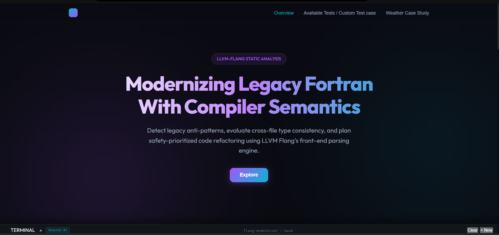
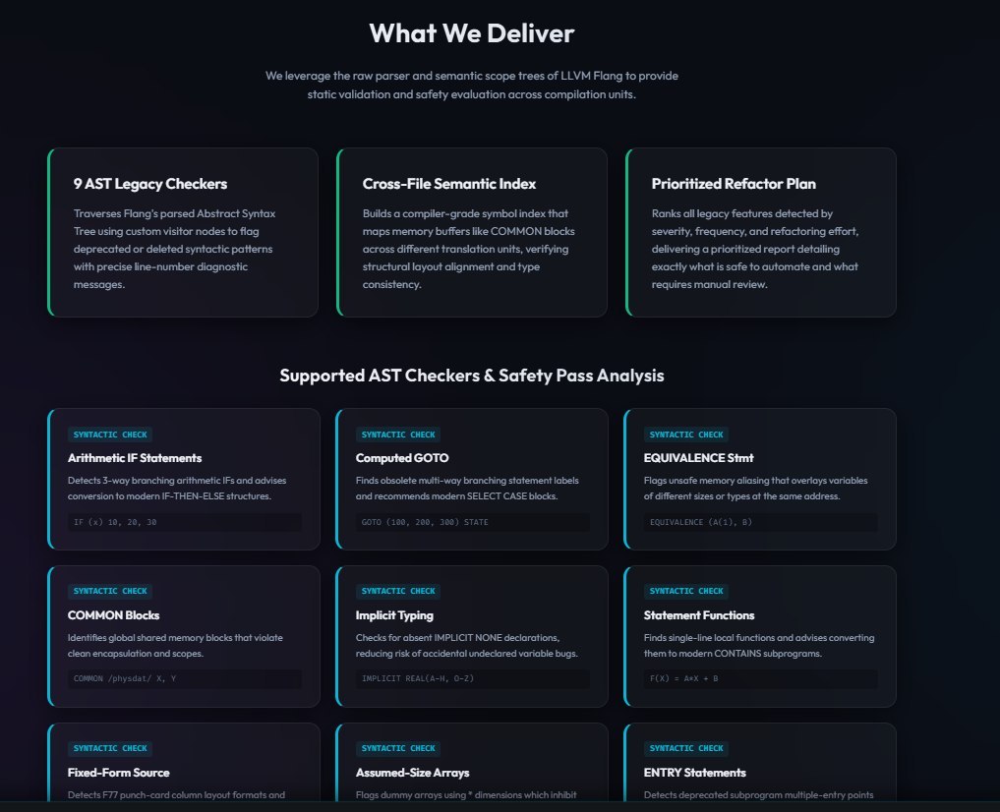
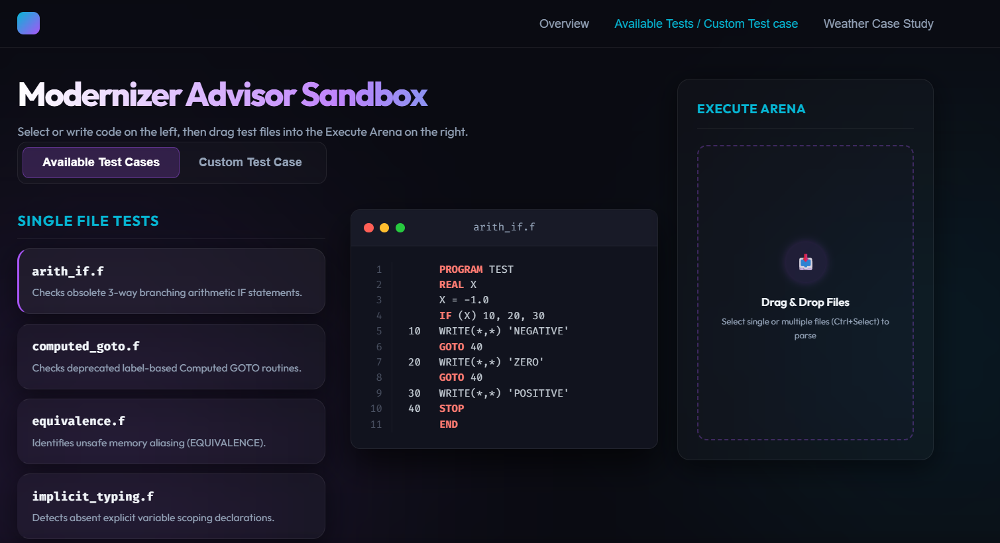
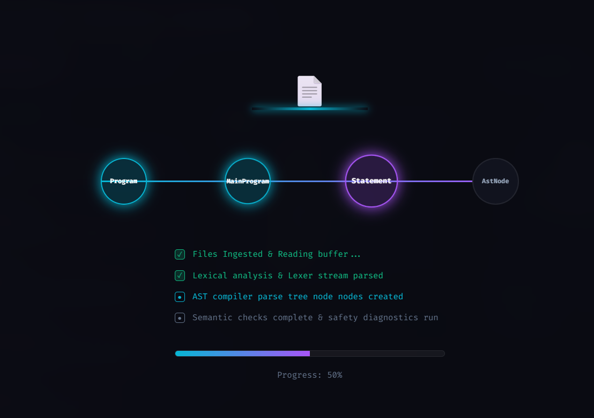
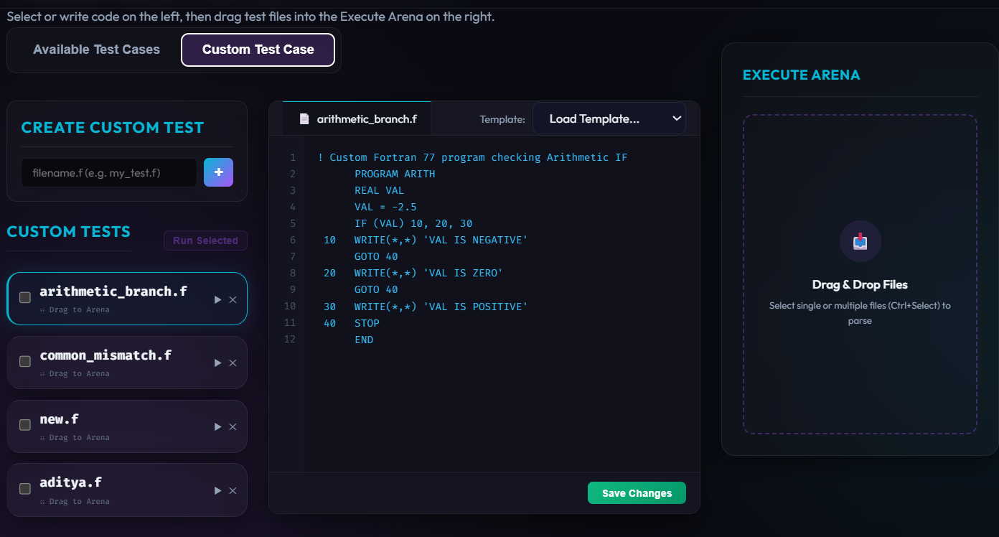
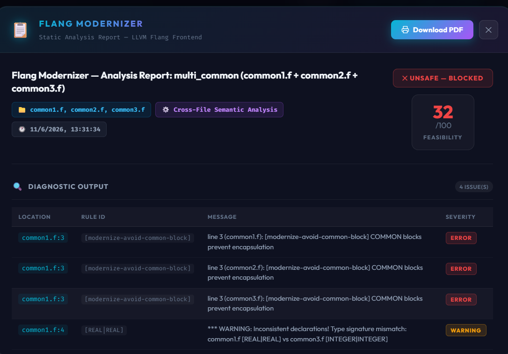
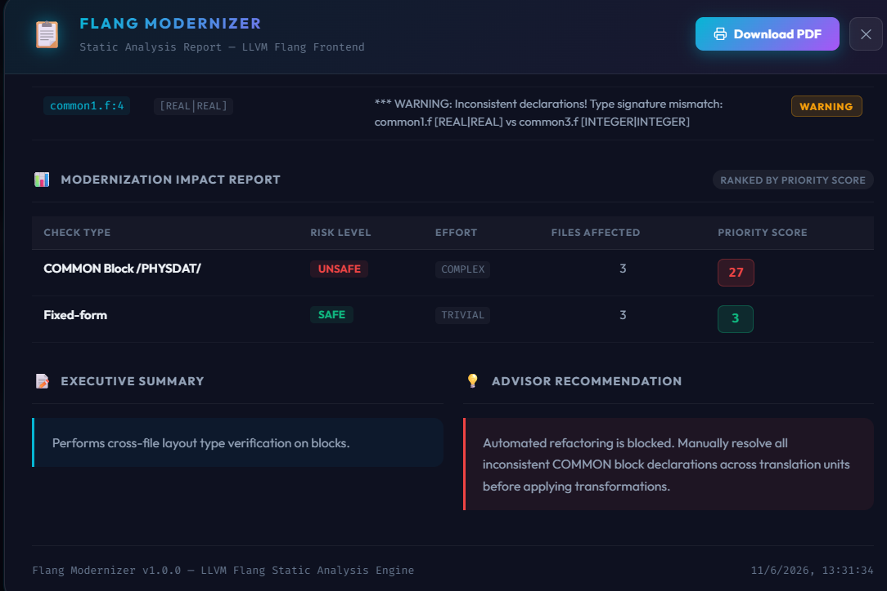
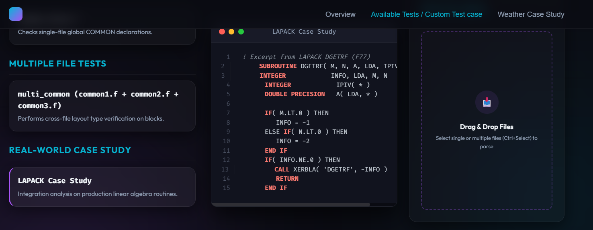
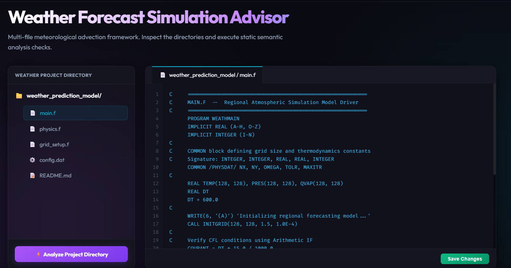
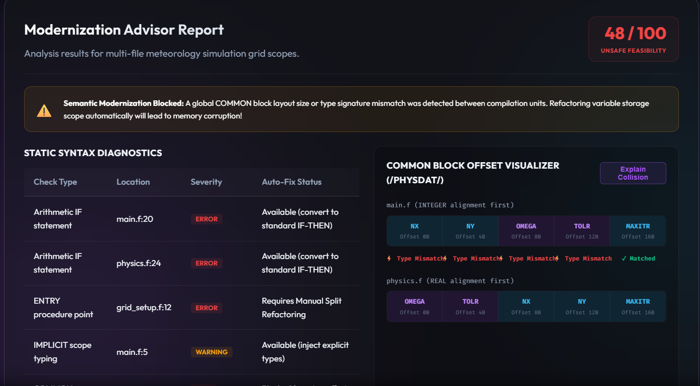

# Flang Modernizer

A multi-phase Fortran legacy code static analysis and modernization advisor, built directly on the **LLVM 20 Flang compiler frontend**.

## What It Does
The `flang-modernizer` is not a simple regex-based linter. It uses real compiler infrastructure (AST traversal and semantic scope linking) to:
1. Detect 9 distinct legacy Fortran 77 anti-patterns.
2. Analyze `COMMON` block consistency across multiple source files simultaneously (preventing type aliasing).
3. Generate a prioritized **Modernization Impact Report** scored by risk and effort, guiding engineers on what to fix first before automated transpilation.

## Repository Structure
- **`src` / `include` / `lib`**: The C++ source code for the tool, split into `Checks` (Phase 1), `ImpactAnalyzer` (Phase 2), and `Reporter` (Phase 3).
- **`tools/flang-modernizer`**: The main executable entry point.
- **`testcases` / `test/legacy`**: Fortran 77 files with known legacy patterns, used by the regression test suite.
- **`case_study`**: Real-world legacy files from the LAPACK scientific computing library.

## Dependencies
- LLVM 20 (including Flang-new and LLVM-dev headers)
- Clang++ 20
- CMake (>= 3.20)
- Ninja Build System
- Linux Environment (e.g., WSL2 Ubuntu)

## How to Build
Use the provided wrapper script:
```bash
./build.sh
```

## How to Run
Use the provided wrapper script and pass one or more Fortran files:
```bash
./run.sh test/legacy/computed_goto.f
./run.sh test/legacy/common1.f test/legacy/common2.f test/legacy/common3.f
```

## Testing
To run the automated diff-based regression suite against baseline files:
```bash
bash test/run_tests.sh
```

## Further Documentation
Please refer to the following documents for project details:
- **`DESIGN.md`**: Architecture and design decisions.
- **`IMPLEMENTATION.md`**: Deep dive into LLVM/Flang integration.
- **`EVALUATION.md`**: Testing metrics and LAPACK case study results.

## Frontend Showcase Web Application
The repository includes an interactive **React + TypeScript + Vite + Glassmorphism CSS** static analyzer sandbox showcase under `flang-modernizer/frontend`:
1. Navigate to the frontend directory:
   ```bash
   cd flang-modernizer/frontend
   ```
2. Install dependencies:
   ```bash
   npm install
   ```
3. Launch the local development server:
   ```bash
   npm run dev
   ```
4. Build the production package:
   ```bash
   npm run build
   ```

### Showcase Gallery

#### 1. Homepage & Dashboard Overview


These screenshots show the landing page of the Flang Modernizer Web Application. It displays an overview of the LLVM-Flang static analysis suite, including the 9 supported syntactic AST checkers and details about the multi-file semantic safety pass analysis.

#### 2. Single-File Testing Sandbox

This screen displays the single-file regression tests panel where developers can explore predefined legacy Fortran 77 test cases (such as arithmetic IF, computed GOTO, etc.). Clicking any test case loads the legacy code into the viewer and sets it up for analysis.

#### 3. AST Parser and Test Case Analysis

Shows the active parsing process and node traversal graph visualization in the Execute Arena. It tracks the step-by-step syntactic verification of the AST parser, verifying construct scopes and outputs live compiler logs to the bottom terminal panel.

#### 4. Custom Test Editor

The custom sandbox playground where users can write, paste, edit, and test their own custom Fortran 77 files. It features line numbers, syntax highlighting guidelines, and a drop zone for dragging files directly from the operating system to analyze them instantly.

#### 5. Modernization Report Generator


These images show the interactive, modal-based Modernization Advisory Report generated after a project analysis. It features a print-ready layout showing a safety verdict badge, feasibility scores, categorized diagnostic checks, and a prioritized risk/effort impact matrix.

#### 6. Real-World Case Study

Highlights the Weather Forecast Case Study dashboard built within the web app. This case study demonstrates the multi-file analysis capability of the tool, running checks across shared variables and subroutines.

#### 7. Workspace & Working Directory

Shows the multi-file directory viewer structure containing the shared global variables, parameters, and weather simulation modules. It illustrates the real-world scale of the codebase being analyzed by the modernization engine.

#### 8. Semantic Alignment Report

Displays the memory offset visualizer for shared `COMMON` blocks (e.g. `/PHYSDAT/`) across `main.f` and `physics.f`. It highlights the detected type/alignment alignment mismatch warning where variable bounds collide, preventing automated refactoring bugs.

## How to Push to Git/GitHub
To push the entire codebase (including the LLVM/Flang C++ compiler backend and the React frontend) to your remote GitHub repository:

1. **Initialize Git (if not already initialized)**
   ```bash
   git init
   ```

2. **Add Remote Origin**
   Link your local repository to your remote GitHub repository:
   ```bash
   git remote add origin https://github.com/YOUR_USERNAME/YOUR_REPOSITORY.git
   ```
   *(If the remote `origin` is already defined, update it using: `git remote set-url origin <url>`)*

3. **Stage All Changes**
   Verify status and stage both backend C++ files and the frontend directory:
   ```bash
   git status
   git add .
   ```

4. **Commit the Changes**
   Commit with a clear modernization message:
   ```bash
   git commit -m "feat: complete interactive compiler frontend, custom sandbox editor, and weather forecast alignment dashboard"
   ```

5. **Push to GitHub**
   Push the committed changes to your default branch (usually `main`):
   ```bash
   git push -u origin main
   ```
